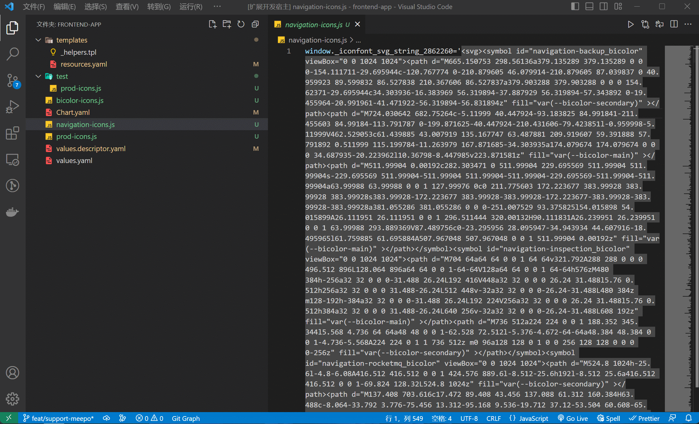

# icon-symbol-preview README

This is the README "Icon Symbol Preview".

## Features

This plugin can read files in your workspace and select those that contain SVG symbol-related files. It can parse these files into a visual icon Webview, and you can copy its symbol ID to the clipboard by clicking on the corresponding icon.

## Extension Settings

Include if your extension adds any VS Code settings through the `contributes.configuration` extension point.

For example:

This extension contributes the following settings:

* `myExtension.enable`: Enable/disable this extension.
* `myExtension.thing`: Set to `blah` to do something.

## Release Notes

Users appreciate release notes as you update your extension.

### 0.0.1
Parse Icon Symbol In WebView

## Following extension guidelines

Ensure that you've read through the extensions guidelines and follow the best practices for creating your extension.

* [Extension Guidelines](https://code.visualstudio.com/api/references/extension-guidelines)

